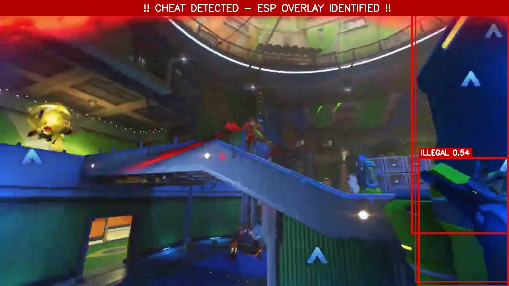
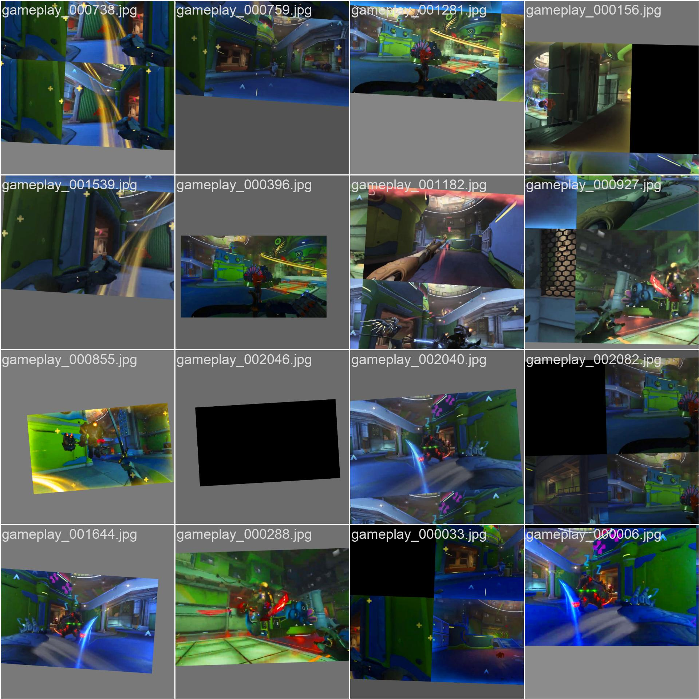
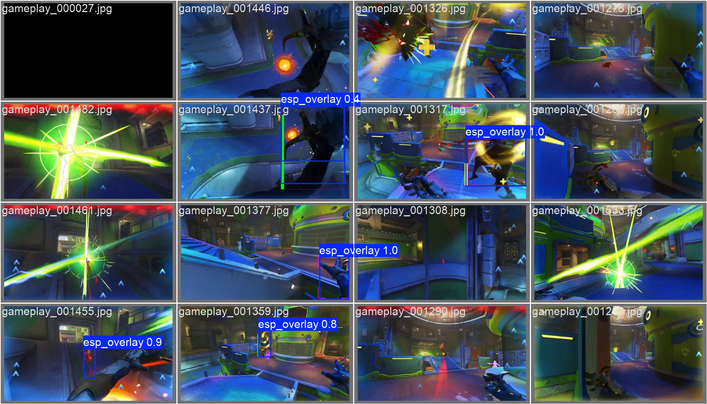

# G-Vision Sentinel

**Visual Anti-Cheat System for ESP/Wallhack Detection**

합성 데이터 생성 + YOLOv11을 활용한 ESP 핵 오버레이 탐지 시스템.

---

## Overview

ESP 핵은 벽 너머 적 위치를 빨간 박스로 보여주는 치트인데, 실제 핵 영상 수집이 어려워서 합성 데이터로 학습시키는 방식을 사용함.

**동작 원리:**
1. 정상 게임 영상에서 사람 탐지 (YOLOv11 pretrained)
2. 탐지된 사람 위에 가짜 ESP 오버레이 그리기
3. 그 오버레이 좌표를 YOLO 라벨로 저장
4. 이걸로 모델 학습 → ESP 오버레이만 찾아냄

---

## Detection Results

### ESP 탐지 예시



상단에 `CHEAT DETECTED - ESP OVERLAY IDENTIFIED` 경고 배너가 뜨고, ESP 오버레이가 `ILLEGAL 0.54`로 탐지됨.

### Training Data Sample



합성 생성된 ESP 오버레이가 포함된 학습 데이터. 모자이크 증강 적용됨.

### Validation Results



검증 데이터에서 `esp_overlay 1.0`, `esp_overlay 0.9` 등 높은 신뢰도로 탐지됨.

---

## Project Structure

```
Project_GD/
├── data/
│   ├── raw/                    # 원본 게임 영상
│   └── synthetic/              # 합성 학습 데이터
│       ├── images/train/
│       ├── images/val/
│       ├── labels/train/
│       └── labels/val/
├── docs/
│   ├── README_KR.md            # 한글 문서
│   ├── TECHNICAL_DOCUMENTATION.md
│   └── AI_ML_BEST_PRACTICES.md
├── runs/
│   ├── esp_detector_*/         # 학습 결과
│   │   └── weights/best.pt
│   └── detect/                 # 추론 결과
├── src/
│   ├── generator.py            # 합성 데이터 생성
│   ├── train.py                # 모델 학습
│   ├── inference.py            # 추론
│   └── utils/
└── requirements.txt
```

---

## Quick Start

### 1. Setup

```bash
conda create -n DG python=3.10 -y
conda activate DG
pip install -r requirements.txt
```

### 2. Generate Synthetic Data

```bash
python -m src.generator --video "data/raw/gameplay.mp4" --frame-skip 3 --max-frames 800
```

### 3. Train

```bash
python -m src.train --epochs 15 --batch 16
```

### 4. Inference

```bash
python -m src.inference --video "data/raw/gameplay.mp4" --output "runs/detect/result.mp4"
```

---

## Parameters

### Data Generation

| Option | Description | Default |
|--------|-------------|---------|
| `--video` | Video path | - |
| `--frame-skip` | Extract every Nth frame | 5 |
| `--max-frames` | Max frames to process | All |

### Training

| Option | Description | Default |
|--------|-------------|---------|
| `--epochs` | Training epochs | 10 |
| `--batch` | Batch size | 16 |
| `--imgsz` | Image size | 640 |

### Inference

| Option | Description | Default |
|--------|-------------|---------|
| `--video` | Input video | (required) |
| `--model` | Model path | Auto-detect latest |
| `--conf` | Confidence threshold | 0.25 |

---

## Performance

| Metric | Value |
|--------|-------|
| mAP@50 | 81.5% |
| Precision | 99.5% |
| Recall | 72.4% |
| Inference Time | ~10ms |
| Real-time FPS | 100+ |

---

## Key Techniques

- **Transfer Learning**: YOLOv11n pretrained on COCO, fine-tuned for ESP overlay detection
- **Synthetic Data**: Generate fake ESP overlays on clean gameplay footage
- **Negative Sampling**: 50% clean frames to reduce false positives
- **Data Augmentation**: Random colors, thickness, styles, coordinate jitter

---

## Documentation

- [한글 README](docs/README_KR.md)
- [Technical Documentation](docs/TECHNICAL_DOCUMENTATION.md)
- [AI/ML Best Practices](docs/AI_ML_BEST_PRACTICES.md)

---

Project: G-Vision Sentinel v1.0.0
